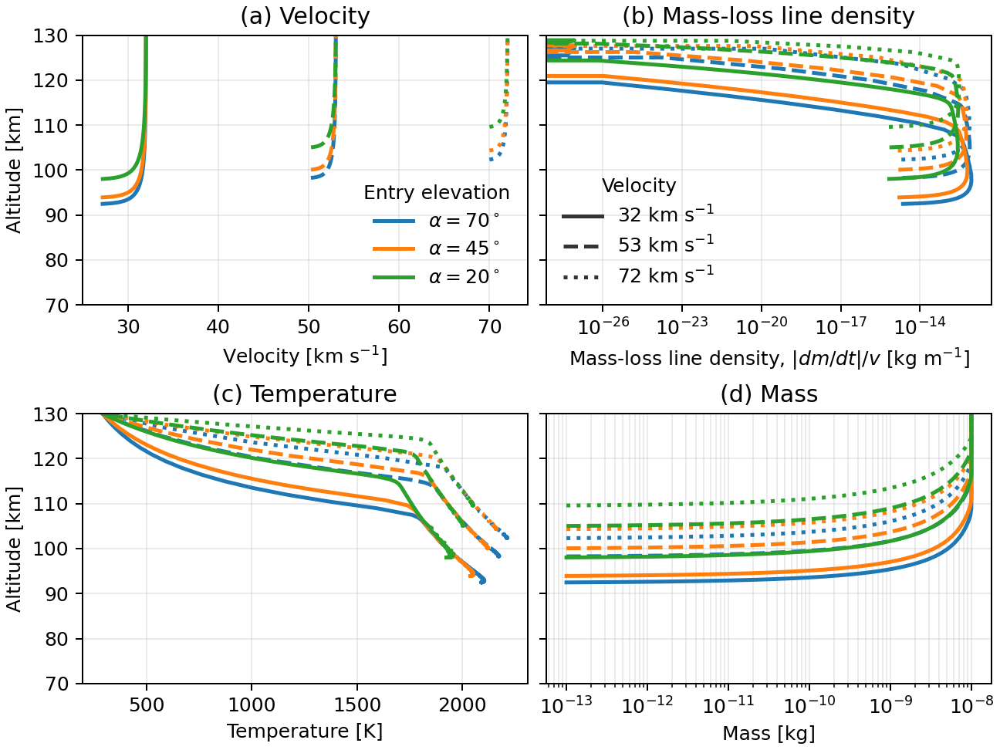

# Meteoroid Ablation Models

## Install

```bash
    pip install ablate
```

## Minimal micrometeoroid ablation model example

The example below runs the built-in `AtmPymsis` atmosphere with the
`KeroSzasz2008` ablation model and recreates a compact sweep over entry
elevation angle and velocity.



```bash
python docs/examples/ablation_sweep.py --output docs/assets/kero_figure1_example.png
```

The core setup is:

```python
import numpy as np
import metablate

model = metablate.KeroSzasz2008(
    atmosphere=metablate.atmosphere.AtmPymsis(),
    config={
        "options": {
            "temperature0": 290,
            "shape_factor": 1.21,
            "emissivity": 0.9,
            "sputtering": False,
            "Gamma": 1.0,
            "Lambda": 1.0,
        },
        "atmosphere": {"version": 2.1},
        "integrate": {
            "minimum_mass_kg": 1e-13,
            "max_step_size_sec": 5e-2,
            "max_time_sec": 5.0,
            "method": "RK45",
        },
    },
)

result = model.run(
    velocity0=53e3,
    mass0=1e-8,
    altitude0=130e3,
    zenith_ang=45.0,
    azimuth_ang=0.0,
    material_data=metablate.material.get("cometary"),
    time=np.datetime64("2018-06-28T12:45:33", "ns"),
    lat=69.30,
    lon=16.04,
    alt=100e3,
)
```

### matplotlib backends

on arch to get matplotlib to work

`pip install Qt5Agg`

and add a `~/.config/matplotlib/matplotlibrc` with `backend:qt5agg`.

see `https://matplotlib.org/stable/tutorials/introductory/usage.html#backends`

### msise00 atmospheric model

make sure cmake is installed! `sudo pacman -S cmake` and also gfortran `sudo pacman -S gcc gcc-fortran` and the basic libs `sudo pacman -S base-devel`

if compilation fails use the enviormennt variables, for bash `export FC="/usr/bin/gfortran"` in fish `set -x FC "/usr/bin/gfortran"`. If cmake still tries to use gcc for compilation, make sure to remove the build folder under `my_env/lib/pythonX.X/site-packages/msise00/build` so that no cached files override the enviornment variables.


```bash
    mkdir /my/env/msise00_source
    cd /my/env/msise00_source
    git clone https://github.com/scivision/msise00
    cd msise00
    pip install -e .
    python -c "import msise00; msise00.base.build()"
```

or

```bash
pip install git+git://github.com/space-physics/msise00.git@main
python -c "import msise00; msise00.base.build()"
```
